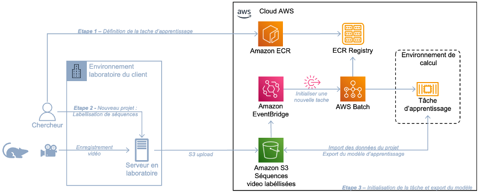

## My Project

<!-- MarkdownTOC autolink="true" markdown_preview="markdown" -->

- [Using AWS Batch and DeepLabCut to automate training of 3D pose estimation models in the Cloud](#using-aws-batch-with-deeplabcut-3d-pose-estimation)
    - [Usage scenario](#usage-scenario)
    - [Architecture](#architecture)
    - [Step 1 - Define the training job in AWS Batch](#step-1)
    - [Step 2 - Prepare the training dataset in-lab](#step-2)
    - [Step 3 - Task execution and model export to S3](#step-3)

<!-- /MarkdownTOC -->


# Using AWS Batch and DeepLabCut to automate training of 3D pose estimation models in the Cloud

## Usage Scenario
This utility is aimed towards scientific research teams who use the DeepLabCut tool to train makerless 3D pose estimation models during their in-lab experiments. It presents a solution to automate the learning phase of the DeepLabCut tool in the cloud, using native AWS technologies. This utility leverages a hybrid architecture that allows a scientist to record and annotate video streams in the research lab, then automatically instantiate a pre-configured compute environment on the AWS Cloud.

An existing solution is to manually create a compute environment in AWS Cloud using EC2 instances, but it comes with limitations. It requires the researcher to manually configure the EC2 instance, and configure the software components that are needed to run the DeepLabCut training task inside EC2. This utility automates this process by preconfiguring an AWS Batch job, and executing the job each time the researcher uploads a new deeplabcut project into Amazon S3.

## Architecture
The hybrid architecture implemented in this guide includes 3 phases:
* Step 1 - Define the training job in AWS Batch
* Step 2 - Prepare the training dataset in-lab
* Step 3 - Task execution and model export to S3

This is an overview of the architecture:



## Step 1 - Define the training job in AWS Batch
The training job definition uses the AWS Batch service, which lets scientists efficiently run  batch and ML computing jobs while optimizing compute resources. This requires first to create a computing environment in AWS Batch using Amazon EC2 as a compute environment, while also choosing an accelerated GPU-based computing instance. The use of the Amazon EC2 computing environment is recommended by AWS to run tasks with AWS Batch that require a GPU graphics processing unit, such as DeepLabCut. The compute environment is created through the function `create_compute_environment` in the Python script `dlc-batch-components.py`. 

The DeepLabCut tool, which is available as a docker image, requires to load the labeled data into the container (e.g., through bind mount), and further to launch the training job by the researcher from the command line.
To automate these steps, build a new image using the existing deeplabcut image as a basis. The new image retrieves at its launch, from a bucket in Amazon Simple Storage Service (S3), the analysis project data preloaded by the researcher in step 2 of this utility. It then trains the model, by invoking the native DeepLabCut functions. At the end of the execution, it exports the output parameters of the model to a bucket in S3.

Use the `Dockerfile` to build the new container image. It extracts the deeplabcut base image, creates environment variables that are used by deeplabcut, and than it invokes the Python script `dlc-train.py` as entry point.
The Python script extracts the labaled dataset from S3, and starts the training task.
It includes three functions:
* `import_dlc_zip_project`: Imports a deeplabcut analysis project from S3 and extracts it inside the container.
* `train_dlc_model`: Starts a training task by invoking native deeplabcut functions.
* `export_dlc_model_s3`: Exports the trained model into S3.

Use the following command to build the new Docker image:

```
[ec2-user@ip-172-31-19-14 ~]$ docker build -t dlc-aws-batch .
```

Export the new image into Amazon ECR. A private ECR registry is assumed to be already created. Refer to AWS documentation for further guidance on creating a private ECR registry (https://docs.aws.amazon.com/AmazonECR/latest/userguide/repository-create.html).

Use the following sample instructions to import the image into Amazon ECR:   

```
aws ecr get-login --region eu-west-3
docker tag dlc-aws-batch:latest 12345678910.dkr.ecr.eu-west-3.amazonaws.com/dlc-aws-batch:latest
docker push 12345678910.dkr.ecr.eu-west-3.amazonaws.com/dlc-aws-batch:latest
```

The Python script `dlc-batch-components.py` includes the function `register_job_definition`, which creates a new job definition using the new container image and specifies appropriate environment variables.

## Step 2 - Prepare the training dataset in-lab
This step takes place in the research lab, and uses the native DeepLabCut functions. An analysis project initiated by the deepLabCut tool has the following file structure:

```
~ % ipython

In [1] : import deeplabcut
In [2] : deeplabcut.create_new_project(‘demo’, ‘test-dlc’, [‘/path-to-videos/demo.avi’])
Created “/home/dlc/projects/videos”
Created “/home/dlc/projects/labeled-data”
Created “/home/dlc/projects/training-datasets”
Created “/home/dlc/projects/dlc-models”
Generated “/home/dlc/projects/config.yaml”

In [3] : path_config = ‘/home/dlc/projects/config.yaml’ 
In [4] : deeplabcut.extract_frames(path_config, ‘automatic’, ‘kmeans’)
In [5] : deeplabcut.label_frames(path_config)
In [6] : deeplabcut.create_training_dataset(path_config)
In [7] : exit()
```
* The `videos`directory includes symbolic links to the experimental video recordings provided as an input parameter to the `create_new_project` function. 
* The `labeled-data` directory contains images annotated manually by the researcher through a graphical interface of the deeplabcut tool.
* The `training-datasets` directory contains the training data used as input to the training model.
* The `config.yaml` file introduces the parameters of the training model, such as labels, and the distribution of training and test data.
* The `dlc-models` directory is currently empty. It is intended to contain the training models built on the AWS cloud, according to the computational task described in step 1.

The `deeplabcut.extract_frames` function in line [4] extracts, from the video recordings, images to be annotated by the researcher. The `deeplabcut.label_frames` function in line [5] exposes a graphical interface where the images are displayed, and where the researcher positions the pose points on the images.

Once the analysis project has been created and the training data has been labeled in the laboratory, generate a `zip` file for the local directory and export it to the Amazon S3 bucket `TGT_S3_BUCKET`, using the path key corresponding to the `DLC_PROJECT_PATH` environment variable defined in step 1.

```
~ % zip -r dossier.zip /home/dlc/projects
```

## Step 3 - Task execution and model export to S3
This step automates the execution of the AWS Batch job definition created in step 1, upon upload into Amazon S3, of the deeplabcut zip project built in step2.
The Python Script `dlc-batch-components.py` includes the functions `create_event_bridge_rule` and `add_tgt_to_event_rule`, which respectively create an EventBridge rule and set the target for the rule as the AWS Batch job definition.

Creation of the `testDLC/dossier.zip` object in the Amazon S3 bucket `TGT_S3_BUCKET` automatically triggers the EventBridge rule, which then invokes the AWS Batch job definition described in step 1. 

## Security

See [CONTRIBUTING](CONTRIBUTING.md#security-issue-notifications) for more information.

## License

This library is licensed under the MIT-0 License. See the LICENSE file.
N.B.: Although this repository is released under the MIT-0 license, its Dockerfile uses the third party DeepLabCut project. The DeepLabCut project's licensing includes the LGPL-3.0 license.
